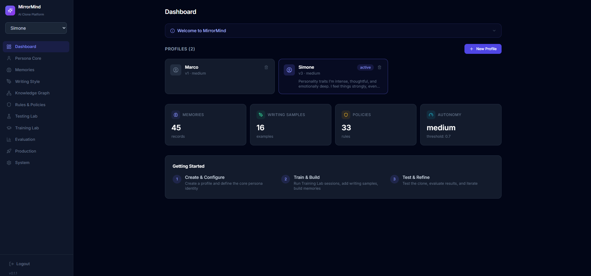
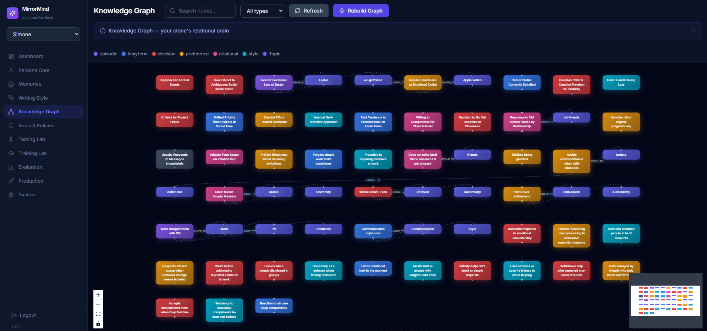

# MirrorMind

<p align="center">
  
</p>

**The open-source framework for building AI clones of yourself — or any persona.**

MirrorMind gives you everything you need to create, train, and deploy an AI that thinks, writes, and responds like a real person. Define a persona's identity, feed it memories and writing samples, set behavioral rules, build a knowledge graph, then test, evaluate, and iterate until the clone is indistinguishable from the original.

Whether you want an AI that answers customers in your voice, a digital twin for content creation, or a character with a consistent personality — MirrorMind is the complete toolkit from raw data to production API.

### What's inside

| Module               | What it does                                                                                                                          |
| -------------------- | ------------------------------------------------------------------------------------------------------------------------------------- |
| **Persona Core**     | Identity, values, tone, humor, communication style, emotional patterns, and mode-specific behavior (work, friend, romantic, conflict) |
| **Memory System**    | Long-term, episodic, relational, and preference memories with confidence scores, LLM-powered extraction, and approval workflows       |
| **Writing Style**    | Analyze real writing samples to capture vocabulary, sentence structure, and stylistic fingerprints                                    |
| **Knowledge Graph**  | Neo4j-backed entity/relationship extraction (GraphRAG) for deep contextual retrieval                                                  |
| **Rules & Policies** | Priority-ranked behavioral constraints the clone must always follow                                                                   |
| **Testing Lab**      | Run conversations, compare clone output side-by-side with your own answers                                                            |
| **Training Lab**     | Generate targeted questions, submit answers, and let the system analyze weak spots                                                    |
| **Evaluation**       | Score responses on accuracy, tone fidelity, memory usage, and policy compliance                                                       |
| **Production**       | Deploy trained clones as authenticated REST API endpoints, ready to integrate anywhere                                                |
| **Extensions**       | Connect your clone to Telegram, Discord, WhatsApp — paste a token, toggle on, done                                                    |
| **Document Import**  | Upload PDF, DOCX, TXT, MD, or JSON documents and extract persona updates, memories, writing samples, and policies with dedupe preview |
| **Quick Import**     | Copy a prompt into ChatGPT, paste back the JSON, and auto-populate memories, writing samples, and policies in seconds                 |

### Key features

- **7 specialized AI Agents** — ResponseGenerator, Critic, Interviewer, StyleAnalyzer, TraitExtractor, TrainingQuestionGenerator, TrainingAnalyst
- **Writing Style Profiling** — automatic analysis of grammar, punctuation, capitalization, emoji habits, and sentence structure
- **Platform Extensions** — Telegram, Discord, and WhatsApp integrations with per-chat conversation history
- **OpenAI-compatible** — works with OpenAI, Ollama, LM Studio, Together, Groq, or any v1-compatible provider
- **Full import/export** — persona bundles as portable JSON
- **Document ingestion** — chunked multi-format document analysis with duplicate-aware preview and save
- **JWT auth** — login, registration, and first-run admin setup
- **Dark theme UI** — modern glass-morphism design with React, TypeScript, and Tailwind CSS
- **Mobile responsive** — fully usable on phone and tablet


---

## Release 0.1.5

- Added **Extensions** page — connect your clone to **Telegram**, **Discord**, and **WhatsApp**
- Telegram: paste a BotFather token, toggle on, your clone responds to Telegram messages
- Discord: paste a bot token (MESSAGE CONTENT intent required), mention the bot or DM it
- WhatsApp: provide Cloud API credentials & configure the webhook endpoint
- All integrations maintain **per-chat conversation history** (20 turns) with `/reset` support
- Added **Writing Style Profiling** — click "Analyze Style" to extract a grammar/punctuation/emoji fingerprint
- Style profile captures: punctuation habits, capitalization, grammar correctness, emoji usage, sentence structure, language mixing, and more
- Style profile is automatically injected into the ResponseGenerator prompt for higher fidelity
- Bots auto-resume on server restart

## Release 0.1.4

- Added **per-user LLM provider settings** (custom API key, base URL, model override)
- Added **JWT authentication** with admin setup flow
- Added **Production Clones** with API key authentication

## Release 0.1.3

- Added **Document Import** for `pdf`, `docx`, `txt`, `md`, and `json`
- Added chunked document analysis so larger files do not rely on a single truncated prompt
- Added duplicate-aware preview and save for memories, writing samples, and policies
- Kept **Quick Import** for ChatGPT-generated JSON bootstrapping

---

## Preview

### Dashboard



### Knowledge Graph



---

## Architecture

```
┌─────────────┐     ┌──────────────┐     ┌─────────────┐
│   Frontend   │────▶│   Backend    │────▶│  PostgreSQL  │
│  React+Vite  │     │   FastAPI    │     │  (pgvector)  │
└─────────────┘     └──────┬───────┘     └─────────────┘
                           │
                    ┌──────┴───────┐
                    │              │
               ┌────▼────┐  ┌─────▼─────┐
               │  Neo4j   │  │  OpenAI /  │
               │ GraphRAG │  │ LLM API   │
               └──────────┘  └───────────┘
```

| Layer               | Technology                                            |
| ------------------- | ----------------------------------------------------- |
| Backend             | Python 3.11+ / FastAPI / SQLAlchemy 2.0 / Pydantic v2 |
| Frontend            | React 18 / TypeScript / Vite / Tailwind CSS           |
| Database            | PostgreSQL 16 (pgvector)                              |
| Graph DB            | Neo4j 5 Community                                     |
| Agent Orchestration | OpenAI Agents SDK                                     |
| Auth                | JWT (python-jose) + bcrypt (passlib)                  |
| Graph Visualization | React Flow                                            |
| State Management    | Zustand                                               |
| Containerization    | Docker Compose                                        |

---

## Quick Start

### Prerequisites

- Python 3.11+
- Node.js 18+
- Docker & Docker Compose (for databases)

### 1. Clone the repository

```bash
git clone https://github.com/YOUR_USERNAME/mirrormind.git
cd mirrormind
```

### 2. Start databases

```bash
docker compose up -d postgres neo4j
```

### 3. Configure environment

```bash
cp backend/.env.example backend/.env
# Edit backend/.env — set OPENAI_API_KEY and SECRET_KEY
```

### 4. Backend setup

```bash
cd backend
python -m venv .venv

# Windows
.venv\Scripts\activate
# macOS/Linux
source .venv/bin/activate

pip install -e ".[dev]"

# Run database migrations
alembic upgrade head

# Start the server
uvicorn app.main:app --reload
```

The API will be available at `http://localhost:8000` (docs at `/docs`).

### 5. Frontend setup

```bash
cd frontend
npm install
npm run dev
```

The UI will be available at `http://localhost:5173`.

### 6. First run

On first launch, MirrorMind will detect no users exist and prompt you to create an **admin account**. This only happens once.

### Full Docker (all services)

```bash
docker compose up --build
```

---

## Happy Path

1. Create an admin account on first launch
2. Create or select a persona
3. Add memories and writing samples, or bootstrap with Document Import / Quick Import
4. Define behavioral policies
5. Rebuild the knowledge graph
6. Run the clone in the Testing Lab
7. Compare output with your own answers in Evaluation
8. Train the clone with targeted Training Lab sessions
9. Click **Analyze Style** on the Writing Style page to generate a grammar/punctuation fingerprint
10. Deploy to production via the Production page
11. Connect to Telegram, Discord, or WhatsApp from the Extensions page
12. Integrate the public API endpoint into your apps

---

## Document Import

The **Document Import** page lets you turn existing personal material into clone training data:

1. Open **Document Import** from the sidebar
2. Upload a supported file: `pdf`, `docx`, `txt`, `md`, or `json`
3. Choose the source kind and optionally add notes for the analyzer
4. Review the extracted persona updates, memories, writing samples, traits, and policies
5. Check the estimated new items and duplicate matches before saving
6. Save the extracted data into the selected persona

What it does well in `0.1.3`:

- Splits long documents into multiple analysis chunks
- Merges chunk results into one structured preview
- Skips duplicate memories, writing samples, and policies on import
- Shows partial coverage when only part of a very large document was analyzed

Current limit:

- Image-only or scanned PDFs still need OCR support; embedded text PDFs work now

---

## Quick Import via ChatGPT

The **Quick Import** page lets you bootstrap a persona in seconds using ChatGPT as the data source:

1. Open the **Quick Import** page from the sidebar
2. **Copy the prompt** — a pre-built prompt that instructs ChatGPT to generate structured data about you
3. **Paste it into ChatGPT** — ideally in a conversation where it already knows you well
4. **Copy the JSON** that ChatGPT returns
5. **Paste it back** into MirrorMind and click **Validate**
6. Review the preview (memories, writing samples, policies) and click **Import**

The system will auto-create all the memories, writing samples, behavioral policies, and update your persona core — no manual data entry needed.

---

## Environment Variables

| Variable            | Description                                           | Default                   |
| ------------------- | ----------------------------------------------------- | ------------------------- |
| `POSTGRES_USER`     | PostgreSQL username                                   | `vsl`                     |
| `POSTGRES_PASSWORD` | PostgreSQL password                                   | `vsl_secret`              |
| `POSTGRES_HOST`     | PostgreSQL host                                       | `localhost`               |
| `POSTGRES_PORT`     | PostgreSQL port                                       | `5432`                    |
| `POSTGRES_DB`       | PostgreSQL database name                              | `mirrormind`              |
| `NEO4J_URI`         | Neo4j bolt URI                                        | `bolt://localhost:7687`   |
| `NEO4J_USER`        | Neo4j username                                        | `neo4j`                   |
| `NEO4J_PASSWORD`    | Neo4j password                                        | `neo4j_secret`            |
| `OPENAI_API_KEY`    | OpenAI API key (or compatible provider key)           | —                         |
| `OPENAI_API_BASE`   | Custom API base URL (leave empty for official OpenAI) | —                         |
| `OPENAI_MODEL`      | LLM model name                                        | `gpt-4o`                  |
| `DEBUG`             | Enable debug mode                                     | `false`                   |
| `LOG_LEVEL`         | Logging level                                         | `INFO`                    |
| `SECRET_KEY`        | JWT signing secret (**change in production**)         | `change-me-in-production` |

---

## Production Clones API

Once a clone is deployed via the Production page, it exposes a public chat endpoint:

```
POST /api/v1/production/chat/{endpoint_id}
```

**Headers** (if API key is required):

```
X-API-Key: mm_your_api_key_here
```

**Request body:**

```json
{
    "message": "Hello, how are you?",
    "context_type": "general",
    "conversation_history": []
}
```

**Response:**

```json
{
    "response": "Hey! I'm doing great, thanks for asking...",
    "confidence": 0.87,
    "requires_review": false,
    "alternative_responses": []
}
```

---

## Extensions — Telegram, Discord, WhatsApp

The **Extensions** page lets you connect your clone to messaging platforms. No coding required.

### Telegram

1. Open [@BotFather](https://t.me/BotFather) on Telegram and create a new bot
2. Copy the bot token
3. Go to **Extensions** → **Add Extension** → **Telegram**
4. Paste the token and click **Create**
5. Toggle the extension **on** — your clone is live on Telegram

Users can DM the bot and it will reply in your clone's voice, with full conversation history.

### Discord

1. Go to [discord.com/developers](https://discord.com/developers/applications) and create an application
2. Add a **Bot**, enable the **MESSAGE CONTENT** intent
3. Use the **OAuth2 URL Generator** (scope: `bot`, permission: `Send Messages`) to invite the bot to your server
4. Copy the bot token
5. Go to **Extensions** → **Add Extension** → **Discord** → paste the token

Users can mention the bot (`@YourBot`) in any channel or DM it directly.

### WhatsApp

1. Set up a [WhatsApp Business App](https://developers.facebook.com) on Meta
2. Get your **permanent access token** (System User token) and **Phone Number ID**
3. Go to **Extensions** → **Add Extension** → **WhatsApp** → fill in access token, phone number ID, and a verify token
4. In Meta's webhook settings, point to: `POST https://your-server/api/v1/extensions/webhooks/whatsapp/{extension_id}`
5. Use the verify token you chose in step 3

### Features

- **Conversation history** — each chat keeps up to 20 turns in memory
- **Reset command** — send `/reset` (Telegram), `!reset` (Discord), or `reset` (WhatsApp) to clear history
- **Auto-resume** — Telegram and Discord bots restart automatically when the server starts

---

## OpenAI-Compatible Providers

MirrorMind works with any provider that implements the OpenAI v1 API standard. Set `OPENAI_API_BASE` in your `.env`:

| Provider         | `OPENAI_API_BASE`                |
| ---------------- | -------------------------------- |
| OpenAI (default) | _(leave empty)_                  |
| Ollama           | `http://localhost:11434/v1`      |
| LM Studio        | `http://localhost:1234/v1`       |
| Together AI      | `https://api.together.xyz/v1`    |
| Groq             | `https://api.groq.com/openai/v1` |

---

## Project Structure

```
mirrormind/
├── backend/
│   ├── app/
│   │   ├── agents/          # OpenAI Agent definitions (7 agents)
│   │   ├── api/             # FastAPI route handlers
│   │   ├── core/            # Config, logging, security, auth deps
│   │   ├── db/              # Database session & base models
│   │   ├── graphrag/        # Neo4j ingestion & retrieval
│   │   ├── models/          # SQLAlchemy ORM models
│   │   ├── schemas/         # Pydantic request/response schemas
│   │   ├── services/        # Business logic (CloneEngine)
│   │   ├── workers/         # Background bots (Telegram, Discord, WhatsApp)
│   │   └── main.py          # App factory
│   ├── alembic/             # Database migrations
│   ├── pyproject.toml
│   └── .env.example
├── frontend/
│   ├── src/
│   │   ├── api/             # API client & interceptors
│   │   ├── components/      # Reusable UI components
│   │   ├── pages/           # Page components
│   │   ├── store/           # Zustand state management
│   │   ├── types/           # TypeScript type definitions
│   │   └── App.tsx          # Router & auth guard
│   └── package.json
├── docker-compose.yml
└── README.md
```

---

## Contributing

1. Fork the repository
2. Create a feature branch (`git checkout -b feature/amazing-feature`)
3. Commit your changes (`git commit -m 'Add amazing feature'`)
4. Push to the branch (`git push origin feature/amazing-feature`)
5. Open a Pull Request

---

## License

This project is licensed under the MIT License. See [LICENSE](LICENSE) for details.
